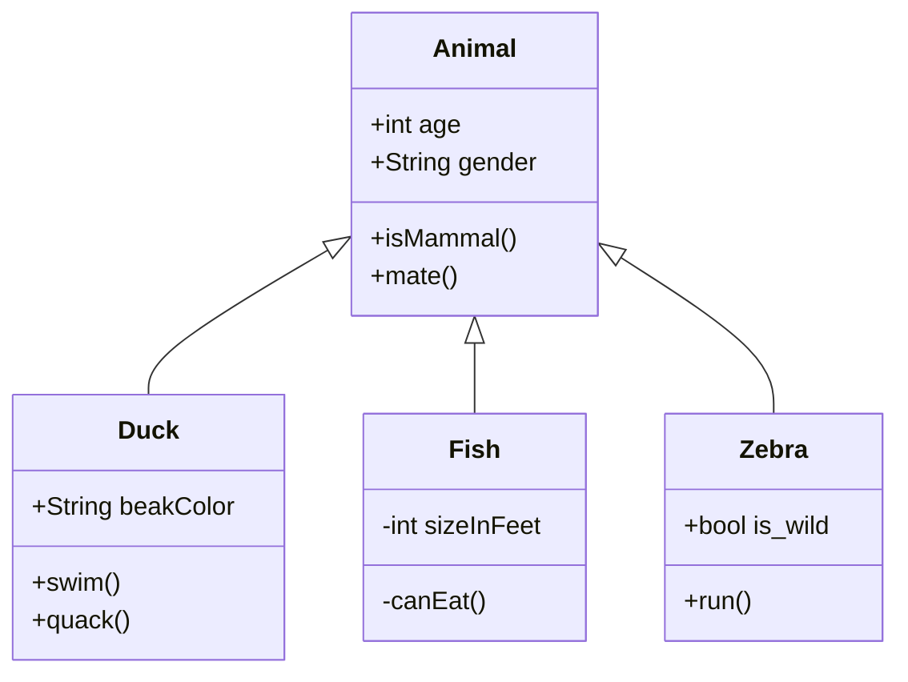

### Introduction

- sample code have inordinate effect
    + people learn from sample code
    + and each other
    + but not from appropriate sources
        * dearth of reference implementations
    + start by learning "to code"
    + many other skills learned by osmosis

- sample code have different purpose than production code
    + demonstrate features
        * may be unnecessary
        * in an improper way
    + differentiate the product
        * from its precursors
        * from its previous versions
        * from its competitors

- sample code does not have the history of production code
    + production code grows
        * new features added
        * more data added
    + production code responds to the changes of its real life purpose
    + production code needs to update its dependencies
        * languages evolve
        * library versions change
        * integration interfaces change

- sample code does not need to evolve continuously
    + does not include how to evolve
        * storage schemas
        * APIs opened
        * APIs used
    + putting a feature into production
        * darkly
        * in multiple changes
        * feature flags

- sample code does not need to be debugged
    + no logging/tracing
    + no versioning

- sample code does not need to scale
    + limited caching
    + not multiple instances
    + no design for scaling

- petclinic is famous (how do we now?)

### Purpose

- Exploration
- Good practices
- Bad practices

### Audience

- devs who want to check
- devs who want to see considerations other than piece together something
- more production ready
- making changes to a system in production

### Scope

- what is in
- what is out

### Existing problems

+ service layer
    - low cohesion ClinicService
    - testing multiple repositories through service layer

+ controllers
    - long controller methods
    - FUBAR update in controller
    - multiple calls to service in controller
    - transaction in controller

+ model
    - unconnected visits and vets
    - unnecessary person supertype

+ dependencies
    - unused jaxb dependency

