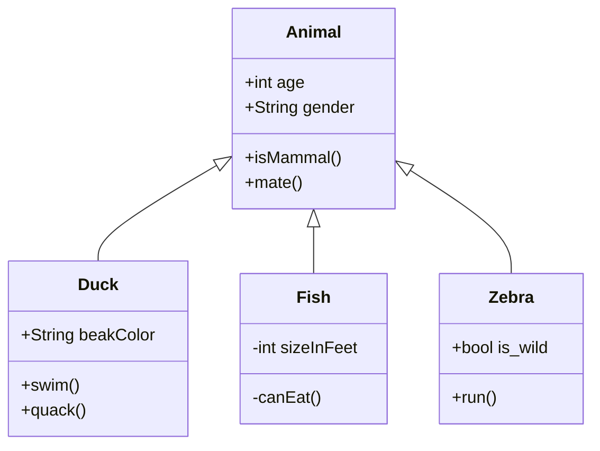

### Purpose

- Exploration
- Good practices
- Bad practices

### Audience

- devs who want to check
- devs who want to see considerations other than piece together something
- more production ready
- making changes to a system in production

### Scope
- what is in
- what is out

### Existing problems

+ service layer
  - low cohesion ClinicService
  - testing multiple repositories through service layer

+ controllers
  - long controller methods
  - FUBAR update in controller
  - multiple calls to service in controller
  - transaction in controller

+ model
  - unconnected visits and vets
  - unnecessary person supertype

+ dependencies
  - unused jaxb dependency

